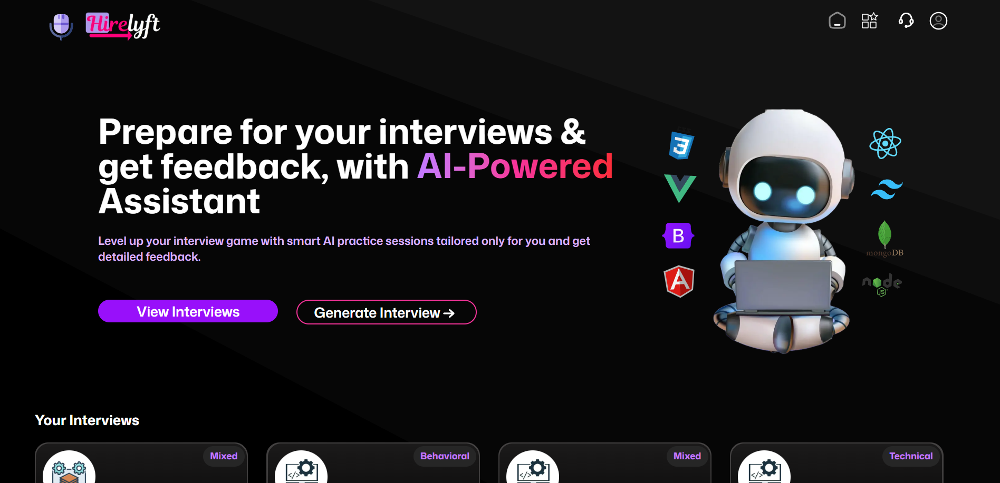

# ✨ Hirelyft — Your AI Interview Companion

 

Hirelyft is an AI-powered **mock interview platform** that allows users to generate, take, and review interviews with detailed feedback across technical and soft skills — all in one seamless and beautiful experience.

## [Try Hirelyft now](https://hirelyft.vercel.app/)

---

## 🚀 Features

### 🧠 Smart Interview Generation
- Generates **custom interview questions** based on:
  - Role
  - Tech stack
  - Experience level
  - Interview type (technical/behavioral/mixed)

### 🎙️ Real-Time Voice Interviews
- Powered by **Vapi SDK**, enabling voice-based interaction for interviews.

### 📊 AI Feedback Analysis
- **Gemini-powered** evaluation that provides:
  - 🎯 Total Score (out of 100)
  - 💬 Soft Skills & Communication evaluation
  - 🧠 Technical Knowledge assessment
  - ✅ Strengths & 🚧 Areas for Improvement

### 🧑‍💼 User Dashboard
- View your generated interviews & feedback
- Explore interviews created by **other users**

### 📬 Support Page
- Raise issues or questions via a **dedicated support page**
- Directly sends an email to the creator using **Web3Forms**

### 📱 Fully Responsive Design
- Optimized for **desktop and mobile**
- Smooth **GSAP animations** and intuitive **UX/UI** with Shadcn UI components

---

## ⚙️ Tech Stack

| Layer             | Tools Used                                                                 |
|------------------|------------------------------------------------------------------------------|
| **Frontend**      | Next.js, React, TypeScript, Tailwind CSS, Shadcn/UI                        |
| **Backend**       | Firebase Firestore, Firebase Auth                                           |
| **AI Models**     | Gemini 2.0 (via `@ai-sdk/google`)                                           |
| **Voice Layer**   | Vapi SDK                                                                    |
| **Animations**    | GSAP (GreenSock)                                                            |
| **Forms**         | Web3Forms (for support messages)                                            |
| **Deployment**    | Vercel                                                                      |

---

